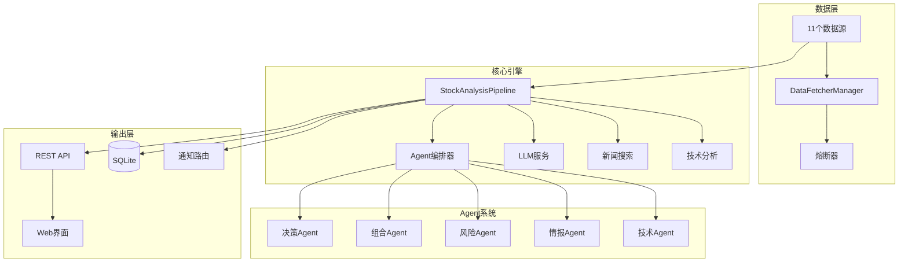

<div align="center">

# 📈 股票智能分析系统 (Java版)

**基于 Spring Boot + 多智能体架构的全自动股票分析平台**

[](https://openjdk.org/)
[](https://spring.io/projects/spring-boot)
[](LICENSE)
[](docker-compose.yml)

*11大数据源 · 6大AI Agent · 14种交易策略 · 13个通知渠道 · 完整WebUI*

</div>

---

## ✨ 特性亮点

- **多智能体协作** — 技术分析、情报研判、风险评估、组合管理、决策综合 5 大专业 Agent 投票共识
- **全市场覆盖** — A股/港股/美股 11 个数据源自动降级切换，内置熔断器保障
- **14种量化策略** — 底部放量、牛趋势、缠论、龙头首板、波浪理论等策略 YAML 配置即用
- **智能通知路由** — 13种推送渠道(企业微信/飞书/Telegram/Discord/邮件等)，支持降噪与路由规则
- **完整Web界面** — 仪表盘、分析、组合、告警、回测、AI问股 8 大功能页面
- **多模式运行** — Web服务/命令行分析/定时调度/大盘复盘/干运行 灵活切换
- **LLM增强** — 兼容 OpenAI API，多渠道 failover，Token 用量实时追踪
- **零外部依赖存储** — SQLite 嵌入式数据库，开箱即用无需安装

---

## 🏗️ 系统架构



---

## 🚀 快速开始

### 环境要求

| 组件 | 版本要求 |
|------|----------|
| JDK | 17+ |
| Maven | 3.8+ |
| Docker (可选) | 20.10+ |

### 方式一：本地运行

```bash
# 1. 克隆项目
git clone <repo-url> && cd j_daily_stock_analysis

# 2. 配置环境变量
cp .env.example .env
# 编辑 .env，至少填入：
#   LLM_API_KEY=your-api-key
#   STOCK_LIST=600519,002594,300750

# 3. 编译打包
mvn clean package -DskipTests

# 4. 启动服务
java -jar target/daily-stock-analysis-1.0.0.jar

# 5. 访问 Web 界面
# 浏览器打开 http://localhost:8000/web/dashboard
```

### 方式二：Docker 一键部署

```bash
# 构建并启动
docker-compose up -d

# 查看日志
docker logs -f dsa-java

# 停止服务
docker-compose down
```

容器默认配置：
- 端口映射：`8000:8000`
- 数据持久化：`./data` → `/app/data`
- 日志目录：`./logs` → `/app/logs`
- 自动健康检查：每 30s 检测 `/api/v1/health`
- 重启策略：`unless-stopped`

---

## 🎛️ 运行模式

| 模式 | 启动参数 | 说明 |
|------|----------|------|
| Web服务 | `--serve` (默认) | 启动 REST API + WebUI，浏览器可视化操作 |
| 单次分析 | `--stocks 600519,AAPL` | 命令行分析指定股票，输出报告后退出 |
| 定时调度 | `--schedule` | 工作日 15:30 自动触发分析并推送通知 |
| 大盘复盘 | `--market-review` | 分析主要指数(上证/深证/创业板/恒生/纳斯达克) |
| 干运行 | `--dry-run` | 跳过 LLM 调用和通知推送，用于调试数据流 |

组合使用示例：
```bash
# 分析指定股票 + 干运行模式
java -jar target/daily-stock-analysis-1.0.0.jar --stocks 600519,300750 --dry-run

# 定时调度 + 大盘复盘
java -jar target/daily-stock-analysis-1.0.0.jar --schedule --market-review
```

---

## 🤖 AI Agent 系统

系统采用多智能体协作架构，支持 4 种编排模式：

| 模式 | Agent组合 | 适用场景 |
|------|-----------|----------|
| `quick` | 技术分析 | 快速筛选、盘中速览 |
| `standard` | 技术+情报+决策 | 日常分析(默认) |
| `full` | 全部6个Agent | 重仓决策、深度研判 |
| `specialist` | 自动选择 | 根据上下文智能调配 |

### Agent 职责

| Agent | 职责 | 输出 |
|-------|------|------|
| **TechnicalAgent** | K线形态、均线系统、量价关系、技术指标 | 技术评分 + 信号 |
| **IntelAgent** | 新闻舆情、政策解读、行业动态 | 情报摘要 + 情绪分 |
| **RiskAgent** | 波动率、回撤、流动性、黑天鹅预警 | 风险等级 + 预警 |
| **PortfolioAgent** | 仓位建议、相关性分析、配置优化 | 仓位建议 |
| **DecisionAgent** | 综合投票、生成最终买卖建议 | 操作信号 + 置信度 |

各 Agent 独立分析后，编排器通过 **加权投票 + 共识算法** 生成最终决策。

---

## 📊 数据源系统

11 个数据源覆盖 A股/港股/美股，内置 **优先级调度 + 熔断降级** 机制：

| 数据源 | 市场 | 说明 | 是否需要Key |
|--------|------|------|:-----------:|
| EFinance | A股 | 东方财富接口，免费高可用 | ❌ |
| AkShare | A股 | 东方财富/证券之星聚合 | ❌ |
| Tushare | A股 | Tushare Pro 专业数据 | ✅ |
| Tencent | A股/港股 | 腾讯财经实时行情 | ❌ |
| BaoStock | A股 | 新浪财经等效替代 | ❌ |
| PytdxFetcher | A股 | 通达信协议(TCP+HTTP降级) | ❌ |
| YFinance | 美股 | Yahoo Finance 全球数据 | ❌ |
| Finnhub | 美股/全球 | 实时行情+基本面 | ✅ |
| AlphaVantage | 美股/全球 | 历史数据+技术指标 | ✅ |
| Longbridge | 港股/美股 | 长桥OpenAPI深度行情 | ✅ |
| TickFlow | A股 | TickFlow 高频数据 | ✅ |

> 数据获取流程：按优先级逐一尝试 → 失败自动切换下一源 → 熔断器保护频繁失败的源 → 恢复后自动重试

---

## 📋 交易策略

内置 14 种量化交易策略，通过 YAML 文件配置，支持自定义扩展：

| 策略 | 类型 | 说明 |
|------|------|------|
| 底部放量 | 量价 | 低位区间显著放量，主力建仓信号 |
| 放量突破 | 量价 | 股价放量突破前期压力位 |
| 缩量回调 | 量价 | 上涨趋势中缩量回踩，抛压不重 |
| 牛趋势 | 均线 | MA多头排列(MA5>MA10>MA20>MA60) |
| 均线金叉 | 均线 | 短期均线上穿长期均线 |
| 一阳穿三阴 | K线 | 一根阳线收复前三根阴线失地 |
| 箱体震荡 | 形态 | 明确上下轨范围内波动 |
| 龙头首板 | 短线 | 板块龙头首次涨停 |
| 热点题材 | 短线 | 市场热点题材轮动 |
| 缠论 | 理论 | 缠中说禅买卖点判断 |
| 波浪理论 | 理论 | 艾略特波浪浪型定位 |
| 情绪周期 | 情绪 | 市场情绪冰点→回暖→高潮→退潮 |
| 事件驱动 | 基本面 | 重大事件驱动的价值重估 |
| 成长质量 | 基本面 | 营收利润持续高增长 |

---

## 🔔 通知系统

支持 13 种通知渠道，通过 `NOTIFICATION_CHANNELS` 环境变量配置启用：

| 渠道 | 环境变量 | 备注 |
|------|----------|------|
| 企业微信 | `WECOM_WEBHOOK_URL` | Markdown格式推送 |
| 飞书 | `FEISHU_WEBHOOK_URL` | 富文本卡片 |
| Telegram | `TELEGRAM_BOT_TOKEN` | Bot消息 |
| Discord | `DISCORD_WEBHOOK_URL` | Embed消息 |
| Slack | `SLACK_WEBHOOK_URL` | Block Kit |
| 邮件(SMTP) | `SMTP_HOST/USER/PASSWORD` | HTML邮件 |
| PushPlus | `PUSHPLUS_TOKEN` | 微信推送 |
| Pushover | `PUSHOVER_USER_KEY` | 移动端推送 |
| ntfy | `NTFY_TOPIC` | 开源推送 |
| Gotify | `GOTIFY_URL` | 自建推送 |
| Server酱3 | `SERVERCHAN3_KEY` | 微信推送 |
| AstrBot | `ASTRBOT_WEBHOOK` | 聊天机器人 |
| 自定义Webhook | `CUSTOM_WEBHOOK_URL` | 任意HTTP端点 |

通知系统特性：
- **智能路由** — 根据消息类型和优先级选择最佳渠道
- **降噪处理** — 避免重复推送，合并相似告警
- **失败重试** — 发送失败自动重试，多渠道 Fallback

---

## 🌐 REST API

所有接口前缀: `http://localhost:8000/api/v1`

| 方法 | 路径 | 说明 |
|------|------|------|
| `GET` | `/health` | 健康检查 |
| `POST` | `/analysis/run` | 触发股票分析 |
| `GET` | `/history` | 查询分析历史 |
| `GET` | `/stocks/{code}/quote` | 获取实时行情 |
| `GET` | `/portfolio` | 查看投资组合 |
| `POST` | `/portfolio` | 更新投资组合 |
| `GET` | `/alerts` | 获取告警规则列表 |
| `POST` | `/alerts` | 创建告警规则 |
| `POST` | `/backtest/run` | 运行策略回测 |
| `GET` | `/decision-signals` | 查看决策信号 |
| `POST` | `/agent/chat` | AI问股对话 |
| `GET` | `/intelligence/{code}` | 获取智能情报 |
| `GET` | `/system-config` | 系统配置信息 |
| `GET` | `/usage` | LLM用量统计 |

### 示例请求

```bash
# 健康检查
curl http://localhost:8000/api/v1/health

# 触发分析
curl -X POST http://localhost:8000/api/v1/analysis/run \
  -H "Content-Type: application/json" \
  -d '{"stocks": "600519,AAPL", "mode": "standard"}'

# AI问股
curl -X POST http://localhost:8000/api/v1/agent/chat \
  -H "Content-Type: application/json" \
  -d '{"message": "分析一下贵州茅台最近走势"}'
```

---

## 🖥️ Web 界面

访问 `http://localhost:8000/web/` 进入可视化管理界面：

| 页面 | 路径 | 功能 |
|------|------|------|
| 仪表盘 | `/web/dashboard` | 大盘情绪、最近分析、组合概览 |
| 股票分析 | `/web/analysis` | 输入股票代码 → 触发分析 → 查看报告 |
| 投资组合 | `/web/portfolio` | 持仓管理、盈亏追踪、风险评估 |
| 告警管理 | `/web/alerts` | 条件监控、自动推送、规则配置 |
| 策略回测 | `/web/backtest` | 选择策略 → 运行 → 绩效可视化 |
| AI问股 | `/web/chat` | 实时对话、智能问答 |
| 分析历史 | `/web/history` | 历史报告查询、趋势对比 |
| 系统设置 | `/web/settings` | 数据源/通知/LLM 配置管理 |

---

## 📁 项目结构

```
j_daily_stock_analysis/
├── src/main/java/com/stock/
│   ├── Application.java              # Spring Boot 主入口
│   ├── config/                       # 配置管理(AppConfig/WebConfig)
│   ├── core/                         # 核心引擎
│   │   ├── StockAnalysisPipeline.java    # 分析流水线(30+步骤编排)
│   │   ├── AnalysisContextBuilder.java   # 上下文装配器
│   │   ├── AnalysisResultAggregator.java # 结果聚合器
│   │   ├── MarketEngine.java             # 大盘引擎
│   │   └── TradingCalendar.java          # 交易日历
│   ├── dataprovider/                 # 数据源适配器(11个 + 熔断管理)
│   ├── llm/                          # LLM服务(多渠道 + Token追踪)
│   ├── agent/                        # AI Agent系统
│   │   ├── AgentOrchestrator.java        # 编排器(4种模式)
│   │   ├── AgentExecutor.java            # 执行引擎
│   │   ├── AgentMemory.java              # Agent记忆
│   │   ├── TechnicalAgent.java           # 技术分析Agent
│   │   ├── IntelAgent.java               # 情报Agent
│   │   ├── RiskAgent.java                # 风险Agent
│   │   ├── PortfolioAgent.java           # 组合Agent
│   │   ├── DecisionAgent.java            # 决策Agent
│   │   ├── skills/                       # Agent技能
│   │   └── tools/                        # Agent工具
│   ├── service/                      # 业务服务层(25个服务)
│   ├── api/controller/               # REST API控制器(14个端点)
│   ├── bot/                          # Bot系统(飞书/钉钉/Telegram)
│   ├── notification/                 # 通知系统
│   │   ├── NotificationRouter.java       # 智能路由
│   │   ├── NotificationService.java      # 通知管理
│   │   └── sender/                       # 13种发送器
│   ├── model/                        # 数据模型(Entity/Enum/Schema)
│   ├── repository/                   # 数据访问层(JPA Repository)
│   ├── scheduler/                    # 定时调度(Quartz)
│   ├── web/                          # WebUI页面控制器
│   └── util/                         # 工具类
├── src/main/resources/
│   ├── templates/                    # Thymeleaf页面模板(8页+报告模板)
│   ├── static/                       # CSS/JS静态资源
│   ├── strategies/                   # 交易策略YAML配置
│   └── application.yml               # Spring Boot配置
├── src/test/                         # 单元测试
├── wiki/                             # 项目文档(10篇)
├── docker-compose.yml                # Docker编排
├── Dockerfile                        # 容器构建
├── pom.xml                           # Maven依赖管理
└── .env.example                      # 环境变量模板
```

---

## 🛠️ 技术栈

| 类别 | 技术 | 版本 |
|------|------|------|
| 运行时 | Java (Eclipse Temurin) | 17 |
| 核心框架 | Spring Boot | 3.2.5 |
| 持久化 | SQLite + JPA/Hibernate | - |
| SQLite方言 | hibernate-community-dialects | - |
| HTTP客户端 | OkHttp | 4.12.0 |
| JSON处理 | Jackson | 2.17.0 |
| 模板引擎 | Thymeleaf | - |
| 认证 | JJWT (JWT) | 0.12.5 |
| 定时任务 | Spring Quartz | - |
| 技术分析 | ta-lib | 0.4.0 |
| 日志 | Logback | - |
| 容器化 | Docker + Alpine | - |

---

## ⚙️ 配置说明

### 核心配置项

```bash
# ===== 必填项 =====
LLM_API_KEY=sk-xxx                    # LLM API密钥(OpenAI兼容)
STOCK_LIST=600519,002594,300750       # 待分析股票列表

# ===== LLM配置 =====
LLM_MODEL=gpt-4o                      # 模型名称
LLM_API_BASE=https://api.openai.com/v1  # API地址
LLM_CHANNELS=                         # 备用渠道(model@base#key)
AGENT_MODE=true                       # Agent模式开关

# ===== 数据源 =====
DATA_PROVIDER=efinance                # 首选数据源
MARKET=A                              # 目标市场: A/HK/US
HISTORY_DAYS=60                       # 历史数据天数

# ===== 通知 =====
NOTIFICATION_CHANNELS=wecom           # 启用的通知渠道(逗号分隔)

# ===== 调度 =====
SCHEDULE_CRON=0 30 15 * * MON-FRI    # 定时分析Cron表达式

# ===== 认证 =====
AUTH_ENABLED=false                    # API认证开关
JWT_SECRET=your-secret                # JWT密钥
JWT_EXPIRE_HOURS=24                   # Token过期时间
```

> 完整配置项参见 [.env.example](.env.example) 文件

---

## 🧪 开发指南

### 构建 & 测试

```bash
# 编译
mvn clean compile

# 运行测试
mvn test

# 打包(跳过测试)
mvn clean package -DskipTests

# 运行开发模式
mvn spring-boot:run
```

### 添加新数据源

1. 在 `dataprovider/` 下创建新类，继承 `BaseDataFetcher`
2. 实现 `getHistoryData()` 和 `getRealtimeQuote()` 方法
3. 在 `DataFetcherManager` 中注册并设置优先级

### 添加新通知渠道

1. 在 `notification/sender/` 下创建新类，继承 `BaseNotificationSender`
2. 实现 `doSend()` 方法
3. 在 `.env` 中添加对应配置项

### 添加新 Agent

1. 实现 `BaseAgent` 接口
2. 添加 `@Component` 注解自动注册
3. 编排器会自动发现并在 `full` 模式下调用

---

## 📚 文档

详细文档位于 `wiki/` 目录：

| 文档 | 内容 |
|------|------|
| [01-项目概述](wiki/01-项目概述.md) | 系统简介与功能概览 |
| [02-系统架构](wiki/02-系统架构.md) | 架构设计与模块关系 |
| [03-快速开始](wiki/03-快速开始.md) | 安装部署与首次运行 |
| [04-配置说明](wiki/04-配置说明.md) | 全量配置项参考 |
| [05-API接口文档](wiki/05-API接口文档.md) | REST API 详细说明 |
| [06-数据源系统](wiki/06-数据源系统.md) | 数据源架构与扩展 |
| [07-AI-Agent系统](wiki/07-AI-Agent系统.md) | Agent设计与协作机制 |
| [08-通知系统](wiki/08-通知系统.md) | 通知渠道与路由规则 |
| [09-分析流水线](wiki/09-分析流水线.md) | Pipeline 处理流程 |
| [10-部署运维](wiki/10-部署运维.md) | 生产部署与监控 |

---

## 📄 License

MIT License - 详见 [LICENSE](LICENSE) 文件
